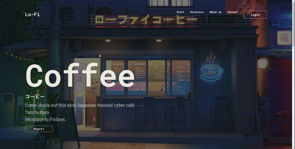
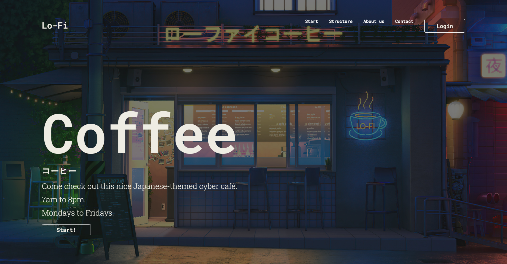
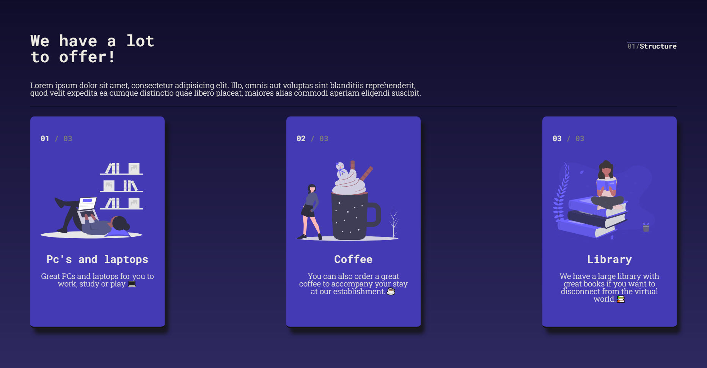
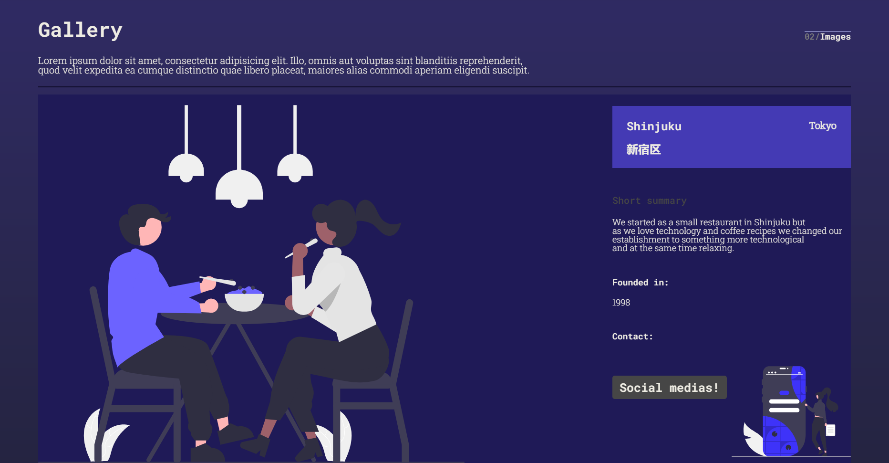
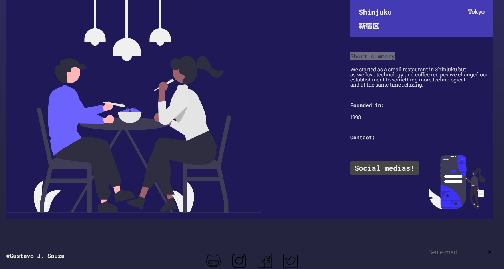

# Cyber Japan Coffee コーヒー

<h2>
 <a href="https://gustavojuvino.github.io/CyberCoffee/">Cyber Coffee Website</a>
</h2>

-This is a web page layout project with a cyber coffee theme located in japan.

-I used the SASS pre-processor, HTML, CSS and some decisions with UI searches.

 -SVG'S site: https://undraw.co/ 

</img>

</img>
</img>
</img>
</img>
